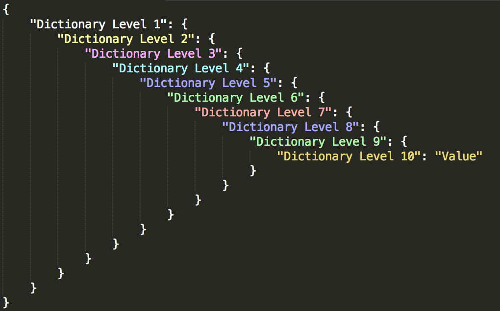
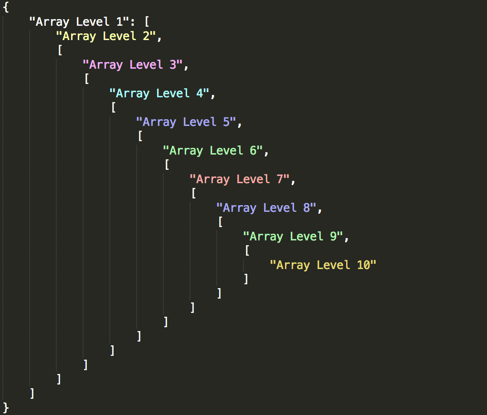
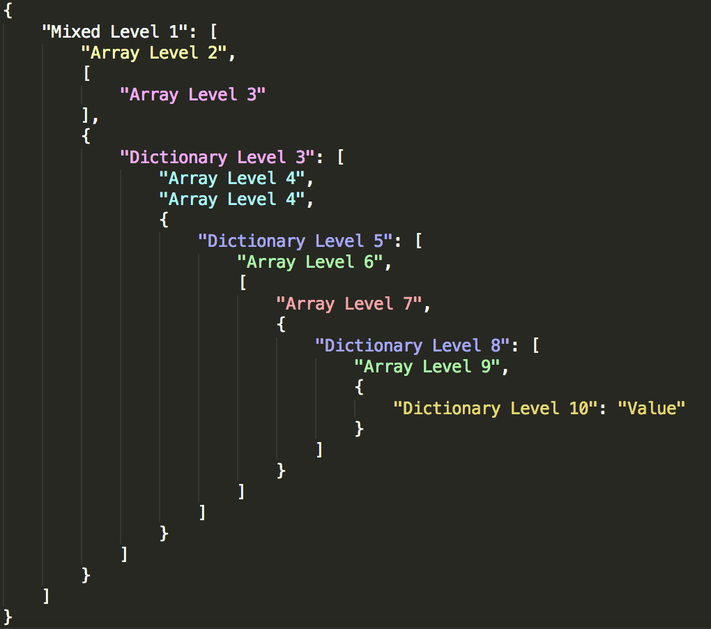

# Sublime Monokai JSON+ Theme
 
The default Sublime Monokai Theme extended by rules that color JSON nicely up to 10 Levels!

## Examples

## Installation

1. Copy the MonokaiJSON+.tmTheme file to your Sublime 2/3 Package Folder:
	
	cp MonokaiJSON+.tmTheme ~/Library/Application Support/Sublime Text 3/Packages/
2. Go to: `Sublime Text/Preferences/Color Scheme` and select the MonokaiJSON+ Theme

## Customization

Take a look at the code/generateRules.py python script. It generates the JSON rules needed to color the multiple levels and all possible combinations of arrays, dictionaries and strings.

1. You can customize the colors or add/remove levels.
2. Run the python script: `python generateRules.py`
3. Open your own Sublime Theme and remove all existing JSON rules (search for 'json')
3. Copy the script output at the end of all other rules just before the `</array>`
 
## Contributing
 
1. Fork it!
2. Create your feature branch: `git checkout -b my-new-feature`
3. Commit your changes: `git commit -am 'Add some feature'`
4. Push to the branch: `git push origin my-new-feature`
5. Submit a pull request ;)
 
## History
 
### 2014-12-21
- 1.0.0 Initial Version

## License
 
The MIT License

Copyright (c) 2014 ColibriApps. https://www.colibriapps.com

Permission is hereby granted, free of charge, to any person obtaining a copy
of this software and associated documentation files (the "Software"), to deal
in the Software without restriction, including without limitation the rights
to use, copy, modify, merge, publish, distribute, sublicense, and/or sell
copies of the Software, and to permit persons to whom the Software is
furnished to do so, subject to the following conditions:

The above copyright notice and this permission notice shall be included in
all copies or substantial portions of the Software.

THE SOFTWARE IS PROVIDED "AS IS", WITHOUT WARRANTY OF ANY KIND, EXPRESS OR
IMPLIED, INCLUDING BUT NOT LIMITED TO THE WARRANTIES OF MERCHANTABILITY,
FITNESS FOR A PARTICULAR PURPOSE AND NONINFRINGEMENT. IN NO EVENT SHALL THE
AUTHORS OR COPYRIGHT HOLDERS BE LIABLE FOR ANY CLAIM, DAMAGES OR OTHER
LIABILITY, WHETHER IN AN ACTION OF CONTRACT, TORT OR OTHERWISE, ARISING FROM,
OUT OF OR IN CONNECTION WITH THE SOFTWARE OR THE USE OR OTHER DEALINGS IN
THE SOFTWARE.