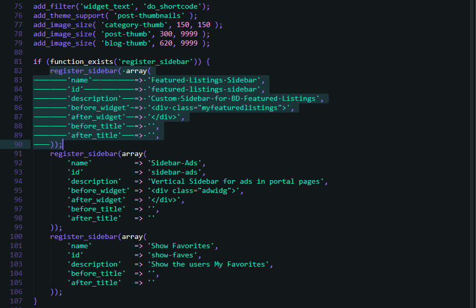

# Pleasant Theme for Sublime Text 2 & 3
 
Colors are teal, purple, seafoam, light indigo, and a tiny bit of pink and white. Includes colors for up to 10 levels of JSON.
This theme is simply based on my favorite colors that I'll be able to look at for hours.

## Examples

## Installation

1. Copy the Pleasant Theme.tmTheme file to your Sublime 2/3 Package Folder:
	`cp Pleasant Theme.tmTheme ~/Library/Application Support/Sublime Text 3/Packages/` on Mac
	`cp Pleasant Theme.tmTheme %UserProfile%\AppData\Roaming\Sublime Text 3\Packages` on Windows
2. Select the theme: `Sublime Text > Preferences > Color Scheme > Pleasant Theme`

## License
 
The MIT License

Copyright (c) 2014-2015 ColibriApps. https://www.colibriapps.com

Permission is hereby granted, free of charge, to any person obtaining a copy
of this software and associated documentation files (the "Software"), to deal
in the Software without restriction, including without limitation the rights
to use, copy, modify, merge, publish, distribute, sublicense, and/or sell
copies of the Software, and to permit persons to whom the Software is
furnished to do so, subject to the following conditions:

The above copyright notice and this permission notice shall be included in
all copies or substantial portions of the Software.

THE SOFTWARE IS PROVIDED "AS IS", WITHOUT WARRANTY OF ANY KIND, EXPRESS OR
IMPLIED, INCLUDING BUT NOT LIMITED TO THE WARRANTIES OF MERCHANTABILITY,
FITNESS FOR A PARTICULAR PURPOSE AND NONINFRINGEMENT. IN NO EVENT SHALL THE
AUTHORS OR COPYRIGHT HOLDERS BE LIABLE FOR ANY CLAIM, DAMAGES OR OTHER
LIABILITY, WHETHER IN AN ACTION OF CONTRACT, TORT OR OTHERWISE, ARISING FROM,
OUT OF OR IN CONNECTION WITH THE SOFTWARE OR THE USE OR OTHER DEALINGS IN
THE SOFTWARE.
